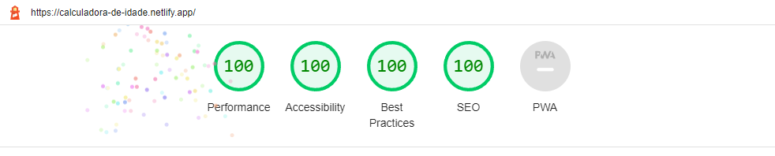

# Age calculator

This program does not actually calculate a person's age. Instead, it simply displays the number that is input along with the message "Sua idade é x anos. 😁", which translates to "Your age is x years 😁". 

## Why this project?

To demonstrate proficiency in basic JavaScript DOM manipulation, one can perform actions such as selecting HTML elements by ID, class, or tag name; manipulating element content, attributes, and styles; creating and appending new elements to the DOM; and handling events like clicks and form submissions. Additionally, one should ensure that their code is structured and organized, using descriptive variable and function names and commenting appropriately to aid in readability and maintainability.

You can access the deployed version of this application at netlify by visiting [calculadora-de-idade.netlify.app](https://calculadora-de-idade.netlify.app/)

 Alternatively, you can find it on GitHub Pages at [vsrromero.github.io/age-calculator/](https://vsrromero.github.io/age-calculator/)

 ## Google Lighthouse

 
